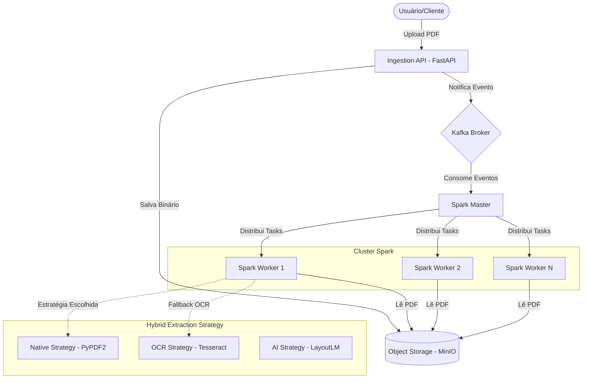
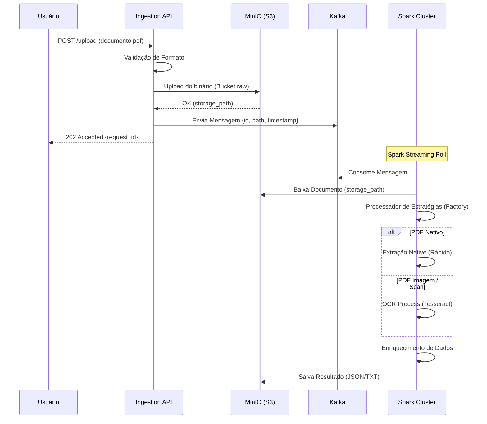

# 🚀 Distributed PDF Extraction Pipeline

Uma solução de alta performance para extração distribuída de texto de milhões de PDFs, utilizando uma arquitetura orientada a eventos, processamento distribuído (Apache Spark) e sistemas de mensageria escaláveis (Kafka).

---

## 🏗️ Design da Arquitetura

O sistema segue uma arquitetura poliglota e distribuída, otimizada para throughput massivo.



---

## 🔄 Fluxograma de Processamento

Abaixo, o fluxo detalhado de como um documento percorre o sistema:



---

## 🛠️ Stack Tecnológica

| Camada | Tecnologia | Papel Principal |
| :--- | :--- | :--- |
| **Interface** | FastAPI | Ingestão e Validação assíncrona |
| **Broker** | Apache Kafka | Desacoplamento e Buffer de carga |
| **Compute** | Apache Spark | Processamento paralelo e distribuído |
| **Storage** | MinIO (S3) | Armazenamento de objetos persistente |
| **OCR** | Tesseract | Extração de texto de imagens |
| **Monitoramento** | Prometheus | Coleta de métricas (Kafka/API) |
| **Dashboard** | Grafana | Visualização de saúde do sistema |

---

## 🚀 Comandos e Exemplos

### 1. Inicialização Completa
Para subir todo o ecossistema (API, Kafka, Spark, MinIO, Grafana):
```bash
docker-compose up -d --build
```

### 2. Configuração de Dependências OCR (Necessário nos Workers)
O Spark necessita do motor Tesseract e bibliotecas Python em todos os nós:
```powershell
docker-compose exec --user root spark-master sh -c "apt-get update && apt-get install -y tesseract-ocr && pip install boto3 PyPDF2 pytesseract Pillow"
docker-compose exec --user root spark-worker sh -c "apt-get update && apt-get install -y tesseract-ocr && pip install boto3 PyPDF2 pytesseract Pillow"
```

### 3. Submissão do Job Spark Streaming
```powershell
docker-compose exec --user root spark-master env HOME=/tmp USER=spark spark-submit \
  --packages org.apache.spark:spark-sql-kafka-0-10_2.12:3.5.1 \
  /app/spark_jobs/extraction_job.py
```

### 4. Exemplo de Ingestão via cURL
```bash
curl -X 'POST' \
  'http://localhost:8000/upload' \
  -H 'accept: application/json' \
  -H 'Content-Type: multipart/form-data' \
  -F 'file=@documento.pdf'
```

---

## 📊 KPIs e Métricas (Observabilidade)

O sistema exporta métricas em tempo real que podem ser visualizadas no **Grafana (Porta 3000)**.

### Indicadores de Performance (KPIs)
*   **Throughput (Docs/min):** Volume de documentos processados pelo cluster Spark por unidade de tempo.
*   **Kafka Consumer Lag:** Diferença entre mensagens produzidas e mensagens processadas. *Crítico para identificar gargalos nos Workers.*
*   **Taxa de Sucesso de Extração:** Percentual de PDFs processados vs. Falhas (ex: arquivos corrompidos).
*   **Latência E2E (End-to-End):** Tempo médio desde o upload até a disponibilidade do texto extraído.
*   **Ocupação de CPU/Memória:** Monitoramento da saúde dos Workers Spark.

---

## 📐 Design de Implementação

O projeto aplica padrões de projeto (GoF) para garantir manutenibilidade:

1.  **Strategy Pattern**: Implementado na pasta `core/interfaces`, permite que novas formas de extração (ex: AWS Textract) sejam adicionadas sem alterar o código do Spark.
2.  **Factory Pattern**: Localizado na `infrastructure/pdf`, decide dinamicamente a melhor estratégia baseado em metadados do arquivo.
3.  **Command Pattern**: As tarefas enviadas ao Kafka agem como comandos encapsulados para os processadores remotos.

---

## 📁 Estrutura do Projeto

```text
/
├── services/ingestion_api     # API FastAPI (Producer)
├── spark_jobs/                # Scripts Spark Streaming (Consumer)
├── core/                      # Lógica de negócio e interfaces
├── infrastructure/            # Implementações (S3, OCR, AI Strategy)
├── config/                    # Configurações globais
└── infrastructure/monitoring  # Configurações Prometheus/Grafana
```

---

## 📈 Roadmap
- [ ] Implementação do **LayoutLM** para reconhecimento de campos chave em formulários.
- [ ] Persistência dos resultados em um banco de dados NoSQL (ex: **MongoDB** ou **Elasticsearch**).
- [ ] Implementação de **Dead Letter Queue (DLQ)** para mensagens que falham repetidamente.