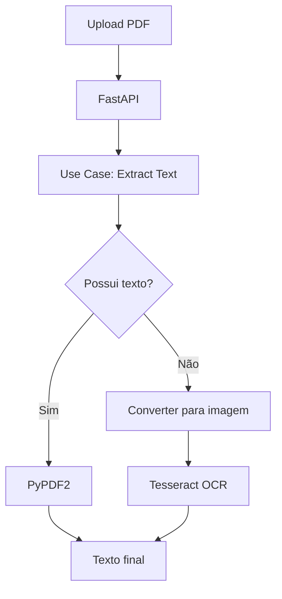

# 📄 PDF Extractor


> 🚀 API moderna para extração de texto de PDFs com OCR, baseada em **Clean Architecture**, pronta para produção e altamente escalável.

---

## 🎯 Visão Geral

O **PDF Extractor** é uma API projetada para extrair texto de documentos PDF de forma inteligente, suportando:

- 📑 PDFs com texto nativo  
- 🖼️ PDFs escaneados (imagens)  
- 🔀 Documentos híbridos  

💡 Ideal para:
- RPA
- ETL de documentos
- Sistemas financeiros
- Processamento jurídico
- Data pipelines

---

## 🧠 Arquitetura

Baseada em **Clean Architecture**, garantindo:

- Baixo acoplamento  
- Alta coesão  
- Fácil manutenção  
- Testabilidade  

---

### 📂 Estrutura do Projeto

```bash
pdf_extractor/
│
├── app/                # API (FastAPI)
├── core/               # Regras de negócio
│   ├── entities/
│   ├── interfaces/
│   └── use_cases/
│
├── infrastructure/     # Implementações externas
│   ├── ocr/
│   └── pdf/
│
├── config/
├── main.py
└── requirements.txt
```

---

## 🔄 Fluxo da Aplicação



---

## ⚙️ Stack Tecnológica

- **FastAPI**
- **Uvicorn**
- **PyPDF2**
- **Tesseract OCR**
- **Pillow**

---

## 🚀 Quick Start

### 🔧 Pré-requisitos

- Python 3.8+
- Tesseract instalado

---

### 1. Clone o projeto

```bash
git clone https://github.com/THPL28/pdf_extractor.git
cd pdf_extractor
```

---

### 2. Instale dependências

```bash
pip install -r requirements.txt
```

---

### 3. Configure o OCR

```python
# config/config.py
TESSERACT_CMD = r"/caminho/para/tesseract"
```

---

### 4. Execute a API

```bash
uvicorn app.api:app --reload
```

---

## 🐳 Rodando com Docker

### 📦 Dockerfile

```dockerfile
FROM python:3.10-slim

WORKDIR /app

COPY . .

RUN apt-get update && \
    apt-get install -y tesseract-ocr && \
    pip install --no-cache-dir -r requirements.txt

CMD ["uvicorn", "app.api:app", "--host", "0.0.0.0", "--port", "8000"]
```

---

### ▶️ Build e Run

```bash
docker build -t pdf-extractor .
docker run -p 8000:8000 pdf-extractor
```

---

## 📡 API

### 🔗 Swagger

👉 http://localhost:8000/docs

---

### 📌 Endpoint

#### `POST /extract_text`

---

### 📥 Request

```bash
multipart/form-data
file: PDF
```

---

### 📤 Response

```json
{
  "filename": "arquivo.pdf",
  "text": "Texto extraído..."
}
```

---

### 🧪 Exemplo com cURL

```bash
curl -X POST http://localhost:8000/extract_text \
  -F "file=@documento.pdf"
```

---

## 🧪 Exemplo com Python

```python
import requests

url = "http://localhost:8000/extract_text"

files = {"file": open("documento.pdf", "rb")}

response = requests.post(url, files=files)

print(response.json())
```

---

## 💡 Estratégia de Processamento

O sistema utiliza abordagem híbrida:

1. 🔍 Extração direta com PyPDF2  
2. 🧠 Fallback para OCR com Tesseract  
3. ⚡ Retorno otimizado  

---

## 📊 Casos de Uso

- 📄 Extração de notas fiscais  
- ⚖️ Documentos jurídicos  
- 🏦 Processamento bancário  
- 📊 Pipelines de dados  
- 🤖 Automação RPA  

---

## 🔮 Roadmap

- [ ] OCR multilíngue  
- [ ] Processamento assíncrono (Celery)  
- [ ] Suporte a tabelas  
- [ ] ElasticSearch  
- [ ] Autenticação JWT  
- [ ] Deploy em cloud (AWS/GCP)  

---

## 🚀 Deploy (Exemplo AWS)

```bash
# Build imagem
docker build -t pdf-extractor .

# Tag para ECR
docker tag pdf-extractor:latest <aws_account_id>.dkr.ecr.region.amazonaws.com/pdf-extractor

# Push
docker push <aws_account_id>.dkr.ecr.region.amazonaws.com/pdf-extractor
```

---

## 🤝 Contribuição

```bash
# Fork
# Crie sua branch
git checkout -b feature/minha-feature

# Commit
git commit -m "feat: nova feature"

# Push
git push origin feature/minha-feature
```

---

## 📜 Licença

MIT License

---

## 👨‍💻 Autor

**Tiago Henrique Looze**  
🔗 https://github.com/THPL28  

---

## ⭐ Support

Se esse projeto te ajudou:

⭐ Deixe uma estrela no repositório  
📢 Compartilhe com outros devs  
🚀 Contribua com melhorias